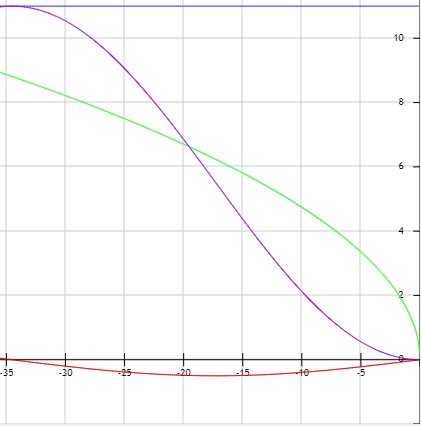

# Capstone Project

This is the project repo for the final project of the Udacity Self-Driving Car Nanodegree: Programming a Real Self-Driving Car. For more information about the project, see the project introduction [here](https://classroom.udacity.com/nanodegrees/nd013/parts/6047fe34-d93c-4f50-8336-b70ef10cb4b2/modules/e1a23b06-329a-4684-a717-ad476f0d8dff/lessons/462c933d-9f24-42d3-8bdc-a08a5fc866e4/concepts/5ab4b122-83e6-436d-850f-9f4d26627fd9).


## Team "LetsGetItDone"

| Name                | E-Mail                   |
| ------------------- | ------------------------ |
| Alessandro Restagno | resta89@gmail.com        |
| Felix Reuß          | reuss.felix@gmail.com    |
| Felix Mueller       | fxsmdlp@gmail.com        |
| Benedikt Naessens   | benenaes@insysive.be     |
| Ilker Altay         | ilkeraltay1981@gmail.com |


## Introduction

The team designed an autonomous car that will be tested on the simulator and, then, on Udacity’s real self-driving car (Carla). As introduced in the Udacity walkthrough videos, the project is organized in three parts:
- the Waypoint Updater;
- the Drive-By-Wire (DBW);
- the Traffic Light Detection.


## Waypoint Updater

This node is implemented in the [wayppoint_updater.py](/ros/src/waypoint_updater/waypoint_updater.py) file.


The Waypoint Updater nodes receives initially the original list of waypoints. It then subscribes for constant updates of the vehicle's pose and the next red traffic light position. In order to make the car drive, a list of the next 100 upcoming waypoints (subset of the original list) is published to the Waypoint Follower node at a rate of $5 Hz$.

In order to achieve this, the index of the next waypoint has to be determined, using an efficient lookup featuring a KDTree data structure.

When approaching a red traffic light (reason to make the car stop in front of), a shaping function is applied to the velocity of the pusblished waypoints.

The following diagram shows the the origimal square root shaped deceleration function over the distance to the upcoming traffic light, as well as the new cosine based velocity function for smoother transitions and limited maximum acceleration.



Based on the current vehicle speed and desired maximum acceleration the required braking distance is calculated.

Target speed ($40 km/h  \cong 11 m/s$, blue curve)

Original velocity profile (green curve):
$v_{new}(x) = min \Big( v_{current}, 1.5 \cdot \sqrt{2 \cdot \text{accel}_{max} · \text{distance}} \Big)$

New velocity profile with smoother begin/end (violet curve):
$v_{new}(x) = \frac{v}{2} (1 - cos(\frac{x}{2 \pi D} ))$

Deceleration over time (red curve):
$a = \frac{dv_{new}(x)}{dx} = \frac{v}{2} \frac{1}{2 \pi D} sin(\frac{x}{2 \pi D})$

Deceleration factor, based on current speed and desired maximum acceleration:
$D = \frac{v}{2} \frac{1}{2 \pi a_{max}}$

The required braking distance:
$dist = \pi^2 D$


## Drive-By-Wire (DBW)

This node is implemented in the [dbw_node.py](/ros/src/twist_controller/dbw_node.py) file.
It's subscribed to the `current_vel`,`twist_cmd` and `dbw_enabled` topics and it publishes the `throttle_cmd`, `brake_cmd` and `steering_cmd` topics.


### Steering

Predictive Steering is implemented using the provided `YawController` class ([yaw_controller.py](/ros/src/twist_controller/yaw_controller.py)).

### Throttle
Throttle is controlled by a linear PID by passing in the velocity error(difference between the current velocity and the proposed velocity)

### Brake
When the PID controller returns a negative value for throttle, it means the car needs to decelerate. The amount of deceleration needed is calculated in these two lines of code:
```
decel = max(vel_error, self.decel_limit)
brake = abs(decel) * self.vehicle_mass * self.wheel_radius # Torque N*m
```
`brake` is the amount of torque that is applied to the brake system to decrease the car's speed.


## Traffic Light Detection
This node is implemented in the [tl_detector.py](/ros/src/tl_detection/tl_detector.py) file.


### Classifier setup

We used image classification (so not object detection) to classify images that contain a red, green, yellow or no traffic light.

The current setup uses Tensorflow-GPU 1.3 and Keras 2.0.8. Classic models that are available in the Keras applications library were used for transfer learning.

The classifier for the simulator is a Resnet-50 network where feature extraction is applied (the last output layer is stripped off). This classifier is extended with an average pooling layer, a dense layer of 1024 nodes with RELU activation, followed by another dense layer with 4 nodes with soft-max activation. The 4 nodes are one-hot encoded outputs that decide if the input image fed to the network contains a "green light", "no light", "yellow light" or "red light". The input images are scaled down first to 224x224. Then, "Imagenet" pre-processing is applied to normalize the colour values. 

The classifier for the parking lot is a VGG19 network where feature extraction is applied. This classifier is extended with an average pooling layer, a dense layer of 512 nodes with RELU activation, followed by a dropout layer with drop rate 0.2, then another dense layer of 128 nodes with RELU activation, again a dropout layer with drop rate 0.2, and finally a dense layer with 3 nodes with soft-max activation. The 3 nodes are one-hot encoded outputs that decide if the input image fed to the network contains a "green light", "no light" or "red light". The "yellow light" case is not covered. The input images are scaled down to 224x224. Then, "Imagenet" pre-processing is applied to normalize the colour values. 

### Training the networks

The Resnet-50 and VGG-19 networks were trained with the following parameters:

- The layers that were already trained on Imagenet had their weights frozen
- L2 regularization was applied on the weights of the dense layers that have been appended to the network with penalization 0.01 
- An Adam optimizer was used for weight updates
- A learning rate of 0.001 (other learning rate values didn't perform better)
- Categorical cross entropy was used as the cost function
- 100 epochs with early stopping after 20 epochs without validation accuracy improvement (to avoid overfitting)
- 80/20 training/validation set split with random shuffling
- Batch size 4 (determined experimentally - balance in between efficiency, shared memory size and overfitting reduction, see: https://arxiv.org/abs/1609.04836)
- Random horizontal flipping of the image for the parking lot set (not for the simulator)
- No random zooming (because some images already have the traffic light close to the edge of the image)
- Random rotation of the image up to 3 degrees
- Random width shift of the image of 2%
- Random height shift of the image of 5%

The details can be found in [last_layer.ipynb](/train/last_layer.ipynb)

The config file [config.json](/train/config.json) describes which network is trained (the other parameters are defined in the Jupyter notebook)

The initial code came from https://github.com/Gogul09/flower-recognition/blob/master/extract_features.py, but was altered, bug fixed and extended by ourselves for our application.

MobileNet, InceptionV3 and XCeption were used as well, but the results were worse or similar.

### Input data

#### Simulator images

Images were recording while driving the simulator mountain track manually. The function *process_traffic_lights()* in [tl_detector.py](/ros/src/tl_detection/tl_detector.py) was adapted so that it stores the images fed to the ROS node. For each image that is saved, also a JSON file is created containing metadata like the states of the traffic light and the distance to the stopping line of the next traffic light.

The JSON files are then processed off-line in [group_files_with_light_state.ipynb](/train/group_files_with_light_state.ipynb) so that the images with no, red, yellow or green traffic lights are grouped in separate folders to be able to use the Keras ImageDataGenerator as a training/validation batch generator. It was assumed that if a stopping line was in a distance of 250 waypoints in front of the car that the traffic lights were visible inside the camera image. On the other hand, it was assumed that if a stopping line was more than 500 waypoints away from the camera image that no traffic light would be visible inside the camera image. Any image recorded in between 250 and 500 waypoints away from a stopping line was discarded, as it is uncertain if the traffic light is visible and if the colour of the traffic light is visible after downscaling.

| Images with:                   | # of images |
| ------------------------------ | ----------- |
| Green traffic lights           | 645         |
| No traffic lights              | 897         |
| Yellow (orange) traffic lights | 194         |
| Red traffic lights             | 846         |

#### Parking lot images

Seven sets of images were used:

- The images provided by the ROS bag file from Udacity
- 6 sets of images from MPEG recordings from other team runs:
  - https://www.youtube.com/watch?v=V8U5_2SFdJs
  - https://www.youtube.com/watch?v=1TjhlsXzrqU
  - https://www.youtube.com/watch?v=fGNzEqoeZtY
  - https://vimeo.com/241961307
  - https://www.youtube.com/watch?v=EDtal9m3cT0
  - https://www.youtube.com/watch?v=thgOUyZodPs
  - The notebook [convert_mpeg_to_jpeg.ipynb](/train/convert_mpeg_to_jpeg.ipynb) was used to extract JPEG files and scale them up to 800x600

The images were manually grouped in separate subfolders (to prepare them for the Keras ImageDataGenerator)

The notebook [prune_files.ipynb](/train/prune_files.ipynb) was then used to balance out the data set so that the number of images with green, red and no traffic light were more or less the same.

| Images with:         | \#  of images |
| -------------------- | ------------- |
| Green traffic lights | 1035          |
| No traffic lights    | 875           |
| Red traffic lights   | 904           |

### Online traffic light classification

The traffic light classifiers are implemented in [tl_classifier.py](/ros/src/tl_detection/light_classifier/tl_classifier.py) for the simulator and [tl_classifier_site.py](/ros/src/tl_detection/light_classifier/tl_classifier_site.py) for the parking lot.

The classifier for the simulator performs well, so that we can use a probability threshold of 0.9 to decide if the network's prediction is reliable or not.

The classifier for the site / parking lot performs not so well for green light detection (10% miss-classification on a test set without any probability thresholding),  so a probability threshold of 0.8 is used for this classifier and even no threshold at all in case of a predicted green light.

### Other techniques

First off, a similar approach (transfer learning) was tried out using pre-trained models from Tensorflow-Hub. This was implemented in [retrain.ipynb](/train/retrain.ipynb). Unfortunately, we found out that the models trained with Tensorflow 1.5 are not backward compatible, so they could not be used in Tensorflow 1.3

Also, a lot of project teams are using object detection. We decided to go for image classification, because:

- It's easier to automatically annotate/label the images. Otherwise, bounding boxes around traffic lights had to be drawn. In the meanwhile, we found out that a tool like Vatic (https://github.com/cvondrick/vatic) could help a lot, because bounding boxes could be interpolated just using a couple of reference images.
- Image classification is a lot faster than object detection. We don't have to skip any images, because inference is happening at 16 Hz on the workspace. We assume that the GPU in Carla is performing a lot better, so even if images come in at a higher frequency than in the simulator, this won't cause problems.
- Well ... it's not really a challenge to mimic what other project teams do :)

## Setup

Please use **one** of the two installation options, either native **or** docker installation.

### Native Installation

* Be sure that your workstation is running Ubuntu 16.04 Xenial Xerus or Ubuntu 14.04 Trusty Tahir. [Ubuntu downloads can be found here](https://www.ubuntu.com/download/desktop).
* If using a Virtual Machine to install Ubuntu, use the following configuration as minimum:
  * 2 CPU
  * 2 GB system memory
  * 25 GB of free hard drive space

  The Udacity provided virtual machine has ROS and Dataspeed DBW already installed, so you can skip the next two steps if you are using this.

* Follow these instructions to install ROS
  * [ROS Kinetic](http://wiki.ros.org/kinetic/Installation/Ubuntu) if you have Ubuntu 16.04.
  * [ROS Indigo](http://wiki.ros.org/indigo/Installation/Ubuntu) if you have Ubuntu 14.04.
* [Dataspeed DBW](https://bitbucket.org/DataspeedInc/dbw_mkz_ros)

  * Use this option to install the SDK on a workstation that already has ROS installed: [One Line SDK Install (binary)](https://bitbucket.org/DataspeedInc/dbw_mkz_ros/src/81e63fcc335d7b64139d7482017d6a97b405e250/ROS_SETUP.md?fileviewer=file-view-default)
* Download the [Udacity Simulator](https://github.com/udacity/CarND-Capstone/releases).

### Docker Installation
[Install Docker](https://docs.docker.com/engine/installation/)

Build the docker container
```bash
docker build . -t capstone
```

Run the docker file
```bash
docker run -p 4567:4567 -v $PWD:/capstone -v /tmp/log:/root/.ros/ --rm -it capstone
```

### Port Forwarding
To set up port forwarding, please refer to the [instructions from term 2](https://classroom.udacity.com/nanodegrees/nd013/parts/40f38239-66b6-46ec-ae68-03afd8a601c8/modules/0949fca6-b379-42af-a919-ee50aa304e6a/lessons/f758c44c-5e40-4e01-93b5-1a82aa4e044f/concepts/16cf4a78-4fc7-49e1-8621-3450ca938b77)

### Usage

1. Clone the project repository
```bash
git clone https://github.com/udacity/CarND-Capstone.git
```

2. Install python dependencies
```bash
cd CarND-Capstone
pip install -r requirements.txt
```
3. Make and run styx
```bash
cd ros
catkin_make
source devel/setup.sh
roslaunch launch/styx.launch
```
4. Run the simulator

### Real world testing
1. Download [training bag](https://s3-us-west-1.amazonaws.com/udacity-selfdrivingcar/traffic_light_bag_file.zip) that was recorded on the Udacity self-driving car.
2. Unzip the file
```bash
unzip traffic_light_bag_file.zip
```
3. Play the bag file
```bash
rosbag play -l traffic_light_bag_file/traffic_light_training.bag
```
4. Launch your project in site mode
```bash
cd CarND-Capstone/ros
roslaunch launch/site.launch
```
5. Confirm that traffic light detection works on real life images
"# First-sketch-last-project-SDC"
